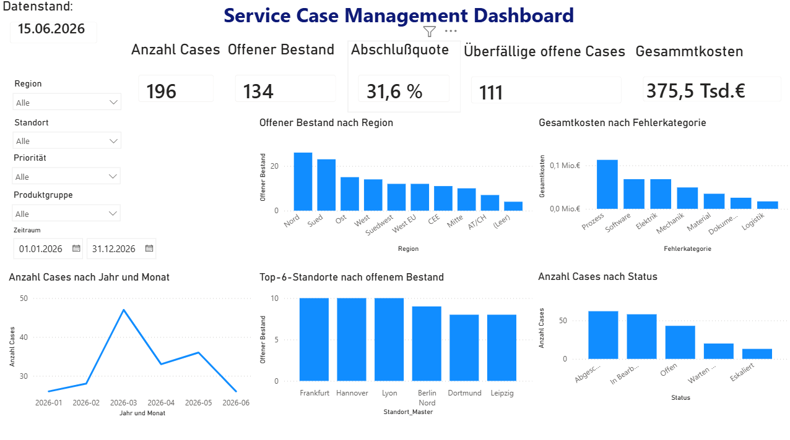
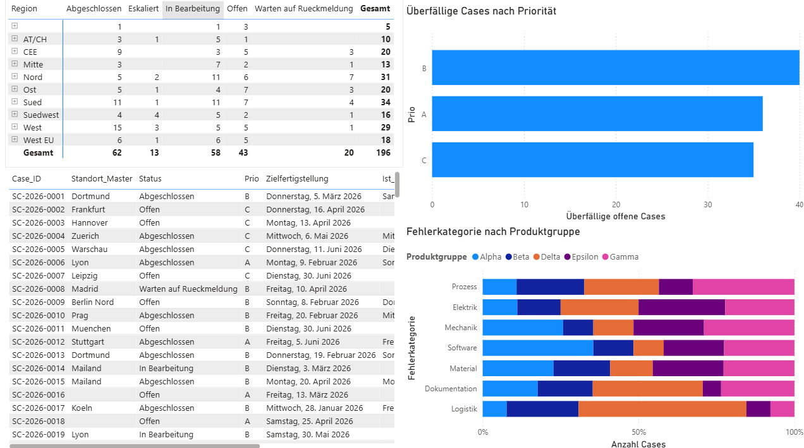
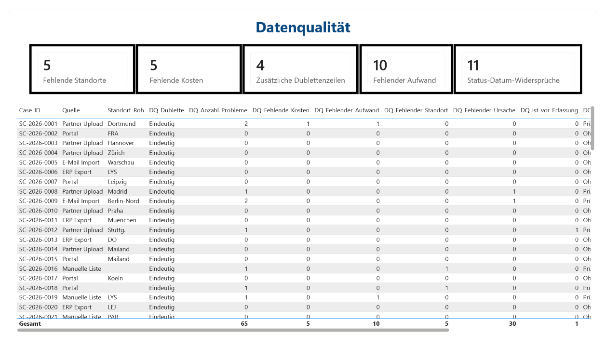

# Dokumentation des Power-BI-Service-Case-Dashboards

## 1. Zielsetzung

Das Power-BI-Dashboard analysiert synthetische Service-Case-Daten eines international tätigen Unternehmens. Ziel ist es, die operative Bearbeitung der Servicefälle transparent darzustellen und gleichzeitig auf Einschränkungen der Datenqualität hinzuweisen.

Der Bericht beantwortet insbesondere folgende Fragen:

- Wie viele eindeutige Servicefälle liegen vor?
- Wie viele Fälle sind abgeschlossen, offen, in Bearbeitung oder eskaliert?
- Wie groß ist der überfällige offene Bestand?
- In welchen Regionen und Standorten konzentrieren sich die offenen Fälle?
- Welche Fehlerkategorien verursachen die höchsten Kosten?
- Wie verteilen sich Fehlerkategorien auf die Produktgruppen?
- Welche fehlenden, doppelten oder widersprüchlichen Daten wurden festgestellt?

Der Bericht besteht aus drei Seiten:

1. **Management Overview** – Gesamtüberblick und zentrale Steuerungskennzahlen
2. **Operative Analyse** – Detailanalyse nach Region, Priorität und Fehlerstruktur
3. **Datenqualität** – Darstellung der erkannten Qualitätsprobleme

---

## 2. Fachliche Grundlage

Die Rohdatentabelle enthält 200 Zeilen. Da vier Case-IDs jeweils doppelt vorkommen, stehen für die operative Analyse 196 eindeutige Servicefälle zur Verfügung.

Die Seite **Datenqualität** verwendet weiterhin alle 200 Rohzeilen, damit Dubletten und weitere Qualitätsprobleme sichtbar bleiben. Die Seiten **Management Overview** und **Operative Analyse** verwenden dagegen die deduplizierte Tabelle mit 196 eindeutigen Case-IDs.

### Berichtsdatum

Als Berichtsdatum wird der **15.06.2026** verwendet. Dieses Datum entspricht dem maximalen Erfassungsdatum im Datensatz. Ein separater fachlicher Datenstichtag wurde in der Aufgabenstellung nicht vorgegeben.

Ein Servicefall gilt in dieser Auswertung als überfällig, wenn:

- sein Status nicht `Abgeschlossen` ist und
- sein Zieltermin vor dem 15.06.2026 liegt.

Durch die Verwendung eines festen, aus dem Datensatz abgeleiteten Berichtsdatums bleiben die Ergebnisse reproduzierbar. Das aktuelle Systemdatum wird bewusst nicht verwendet.

---

## 3. Dashboardseite „Management Overview“



### 3.1 Zweck der Seite

Die Seite **Management Overview** richtet sich primär an Führungskräfte und Entscheidungsträger. Sie verdichtet die wichtigsten Informationen zu Fallbestand, Bearbeitungsfortschritt, Terminsituation und Kosten auf einer Seite.

### 3.2 Filterbereich

Auf der linken Seite stehen folgende Filter zur Verfügung:

- Region
- Standort
- Priorität
- Produktgruppe
- Zeitraum

Mit diesen Filtern können die Kennzahlen und Diagramme auf bestimmte organisatorische oder fachliche Teilbereiche eingeschränkt werden. Beispielsweise kann ausschließlich die Region `Nord`, ein einzelner Standort oder eine bestimmte Produktgruppe analysiert werden.

Der Zeitraumfilter bezieht sich standardmäßig auf das Erfassungsdatum der Servicefälle. Das Berichtsdatum bleibt unabhängig von den gesetzten Filtern unverändert.

### 3.3 KPI „Anzahl Cases“

**Wert: 196**

Die Kennzahl zeigt die Anzahl der eindeutigen Servicefälle nach der Dublettenbereinigung. Sie basiert auf einem `DISTINCTCOUNT` der Case-ID in der bereinigten Analysetabelle.

Die Kennzahl beantwortet:

> Wie viele unterschiedliche Servicefälle enthält die analysierte Datenbasis?

### 3.4 KPI „Offener Bestand“

**Wert: 134**

Zum offenen Bestand zählen alle Fälle, deren Status nicht `Abgeschlossen` lautet. Dazu gehören:

- Offen
- In Bearbeitung
- Warten auf Rückmeldung
- Eskaliert

Damit sind 134 von 196 eindeutigen Fällen noch nicht abgeschlossen. Das entspricht rund 68,4 % des gesamten Fallbestands.

Die Kennzahl zeigt einen hohen noch zu bearbeitenden Bestand. Sie ist jedoch nicht isoliert als Leistungsdefizit zu interpretieren, da keine Sollquote oder ein vollständig definierter Beobachtungszeitraum vorliegt.

### 3.5 KPI „Abschlussquote“

**Wert: 31,6 %**

Die Abschlussquote gibt den Anteil der abgeschlossenen Cases an allen eindeutigen Cases an:

```text
Abschlussquote = abgeschlossene Cases / alle eindeutigen Cases
```

Im Datensatz sind 62 von 196 Servicefällen abgeschlossen:

```text
62 / 196 = 31,6 %
```

Die Kennzahl beschreibt den aktuellen Bearbeitungsstand der Datenbasis.

### 3.6 KPI „Überfällige offene Cases“

**Wert: 111**

Diese Kennzahl zählt offene Servicefälle, deren Zieltermin vor dem Berichtsdatum liegt. Von 134 offenen Fällen sind 111 überfällig. Das entspricht ungefähr 82,8 % des offenen Bestands.

Der hohe Wert deutet auf einen erheblichen Bearbeitungsrückstand hin. Mögliche Ursachen könnten sein:

- begrenzte Bearbeitungskapazität
- ungeeignete Priorisierung
- Abhängigkeiten von Kunden oder Partnern
- Prozessprobleme
- unrealistisch gesetzte Zieltermine
- fehlerhafte Statuspflege

Die Daten zeigen jedoch nicht eindeutig, welche dieser Ursachen tatsächlich vorliegt. Dafür wäre eine fachliche Ursachenanalyse notwendig.

### 3.7 KPI „Gesamtkosten“

**Wert: ungefähr 375.467 EUR**

Die Kennzahl summiert die vorhandenen Werte aus `Kosten_EUR` für die 196 eindeutigen Servicefälle.

Da fünf Rohdatensätze keinen Kostenwert besitzen, sind die Gesamtkosten möglicherweise unvollständig. Die Kennzahl ist daher als Summe der dokumentierten Kosten zu interpretieren.

Empfohlene Anzeige in Power BI:

```text
375.467 EUR
```

oder:

```text
375,5 Tsd. EUR
```

Die Kombination `375.467 Tsd. EUR` wäre missverständlich, da sie als 375 Millionen EUR interpretiert werden könnte.

### 3.8 Diagramm „Offener Bestand nach Region“

Das Säulendiagramm zeigt die Verteilung der noch nicht abgeschlossenen Fälle auf die Regionen.

Aus der Darstellung wird sichtbar:

- Die Region `Nord` besitzt den höchsten offenen Bestand.
- Danach folgt die Region `Sued`.
- `Ost` und `West` liegen im mittleren Bereich.
- Die Kategorie `(Leer)` enthält Fälle, denen wegen eines fehlenden Standorts keine Region zugeordnet werden konnte.

Das Diagramm beantwortet:

> In welchen Regionen konzentriert sich der operative Bearbeitungsrückstand?

Die absoluten Fallzahlen sollten ergänzend zur Standortkapazität betrachtet werden. Eine Region mit vielen offenen Fällen kann gleichzeitig auch ein besonders hohes gesamtes Fallaufkommen besitzen.

### 3.9 Diagramm „Gesamtkosten nach Fehlerkategorie“

Das Diagramm zeigt die Summe der Servicekosten je Fehlerkategorie.

Die Fehlerkategorie `Prozess` verursacht mit ungefähr 112.673 EUR das höchste Kostenvolumen. Danach folgen insbesondere die Kategorien `Software` und `Elektrik`.

Managementinterpretation:

> Prozessbezogene Servicefälle stellen den größten Kostenblock dar und sollten hinsichtlich wiederkehrender Ursachen und möglicher Prozessverbesserungen vertieft untersucht werden.

Hohe Gesamtkosten können sowohl durch viele einzelne Fälle als auch durch wenige sehr teure Fälle entstehen. Ergänzend sollte deshalb der Durchschnitt der Kosten je Case betrachtet werden.

### 3.10 Diagramm „Anzahl Cases nach Jahr und Monat“

Das Liniendiagramm zeigt die Anzahl neu erfasster Servicefälle pro Monat. Es beantwortet:

> Wie entwickelt sich der Eingang neuer Servicefälle im Zeitverlauf?

Die X-Achse muss chronologisch sortiert sein:

```text
2026-01 → 2026-02 → 2026-03 → 2026-04 → 2026-05 → 2026-06
```

Da der Datenstand am 15.06.2026 endet, ist Juni kein vollständiger Monat. Ein niedrigerer Juniwert darf deshalb nicht ungeprüft als tatsächlicher Rückgang des Fallaufkommens interpretiert werden.

### 3.11 Diagramm „Standorte nach offenem Bestand“

Das Balkendiagramm zeigt die Standorte mit dem höchsten offenen Bestand. Auffällig sind insbesondere:

- Frankfurt
- Hannover
- Lyon
- Berlin Nord
- Dortmund
- Leipzig

Frankfurt, Hannover und Lyon besitzen jeweils ungefähr zehn offene Fälle.

Das Diagramm unterstützt die Frage:

> An welchen Standorten ist der operative Bearbeitungsrückstand besonders hoch?

Wenn durch einen Gleichstand sechs Standorte angezeigt werden, sollte der Titel nicht `Top-5-Standorte`, sondern beispielsweise `Standorte mit höchstem offenem Bestand` lauten. Alternativ muss das Ranking technisch auf exakt fünf Positionen begrenzt werden.

### 3.12 Diagramm „Anzahl Cases nach Status“

Das Diagramm zeigt die Statusverteilung der 196 eindeutigen Servicefälle:

| Status | Anzahl Cases |
|---|---:|
| Abgeschlossen | 62 |
| In Bearbeitung | 58 |
| Offen | 43 |
| Warten auf Rückmeldung | 20 |
| Eskaliert | 13 |
| **Gesamt** | **196** |

Besondere Aufmerksamkeit verdienen:

- 13 eskalierte Fälle mit potenziell erhöhtem Handlungsbedarf
- 20 Fälle, bei denen eine Rückmeldung aussteht
- 43 offene Fälle, deren Bearbeitung möglicherweise noch nicht begonnen hat

---

## 4. Dashboardseite „Operative Analyse“



### 4.1 Zweck der Seite

Die Seite **Operative Analyse** richtet sich an Serviceleitung, Teamleitung und operative Verantwortliche. Sie ermöglicht eine detailliertere Untersuchung nach Region, Standort, Status, Priorität, Produktgruppe und Fehlerkategorie.

### 4.2 Matrix „Cases nach Region und Status“

Die Matrix verteilt die 196 eindeutigen Cases nach Region und Status. Die Spalten zeigen:

- Abgeschlossen
- Eskaliert
- In Bearbeitung
- Offen
- Warten auf Rückmeldung
- Gesamt

Über das Pluszeichen können die Regionen bis auf Standortebene aufgeklappt werden.

Beobachtungen:

- `Sued` besitzt mit 34 Cases das höchste gesamte Fallaufkommen.
- `Nord` folgt mit 31 Cases.
- `West` besitzt 29 Cases, davon 15 abgeschlossene Fälle.
- `Suedwest` weist vier eskalierte Fälle auf.
- Fünf Cases können aufgrund fehlender Standortangaben keiner Region zugeordnet werden.

Die Matrix eignet sich zur Bestandssteuerung, da Gesamtvolumen und Statusverteilung gleichzeitig sichtbar sind.

### 4.3 Diagramm „Überfällige Cases nach Priorität“

Das Balkendiagramm verteilt die 111 überfälligen offenen Cases auf die Prioritätsklassen:

- Priorität B: ungefähr 40 Cases
- Priorität A: ungefähr 36 Cases
- Priorität C: ungefähr 35 Cases

Das Diagramm beantwortet:

> In welchen Prioritätsklassen konzentriert sich der überfällige Bestand?

Die fachliche Rangfolge der Prioritäten ist in den Quelldaten nicht definiert. Es wurde daher nicht angenommen, ob `A`, `B` oder `C` die höchste Priorität darstellt. Vor einer risikobasierten Interpretation müsste die Rangfolge fachlich bestätigt werden.

### 4.4 Diagramm „Fehlerkategorie nach Produktgruppe“

Das 100-%-gestapelte Balkendiagramm zeigt für jede Fehlerkategorie die prozentuale Verteilung auf die Produktgruppen:

- Alpha
- Beta
- Delta
- Epsilon
- Gamma

Das Diagramm beantwortet:

> Welche Produktgruppen tragen innerhalb einer Fehlerkategorie besonders stark zum Fallaufkommen bei?

Aus der Darstellung wird beispielsweise sichtbar:

- Prozessfälle betreffen alle Produktgruppen.
- Logistikfälle konzentrieren sich besonders stark auf `Delta`.
- Softwarefälle besitzen einen vergleichsweise hohen Anteil der Produktgruppe `Alpha`.
- Die Produktzusammensetzung unterscheidet sich zwischen den Fehlerkategorien.

Da es sich um ein 100-%-Diagramm handelt, werden relative Anteile und nicht direkt die absoluten Fallzahlen dargestellt. Eine kleine Fehlerkategorie kann dadurch optisch genauso breit erscheinen wie eine große Kategorie. Absolute Fallzahlen sollten über Tooltips oder zusätzliche Datenbeschriftungen verfügbar sein.

### 4.5 Case-Detailtabelle

Die Detailtabelle zeigt einzelne Servicefälle mit operativ relevanten Informationen:

- Case-ID
- Masterstandort
- Status
- Priorität
- Zieltermin
- Ist-Fertigstellungsdatum
- Aufwand
- Kosten

Die Tabelle ermöglicht den Wechsel von der aggregierten Analyse zum einzelnen Case. Wird beispielsweise in einem Diagramm eine Region oder Priorität ausgewählt, wird die Detailtabelle automatisch auf die betroffenen Fälle eingeschränkt.

Typischer Analyseablauf:

1. Auffällige Region oder Priorität auswählen.
2. Betroffene Case-IDs in der Detailtabelle identifizieren.
3. Status und Zieltermin prüfen.
4. Überfällige oder eskalierte Vorgänge operativ nachverfolgen.

---

## 5. Dashboardseite „Datenqualität“



### 5.1 Zweck der Seite

Die Seite **Datenqualität** zeigt, welche Einschränkungen in den Rohdaten bestehen. Sie basiert bewusst auf allen 200 Rohzeilen, damit auch Dubletten und problematische Datensätze sichtbar bleiben.

Die Seite beantwortet:

> Wie belastbar ist die Datenbasis, auf der die Managementkennzahlen beruhen?

### 5.2 KPI „Fehlende Standorte“

**Wert: 5**

Fünf Datensätze besitzen keinen Wert in `Standort_Roh`.

Auswirkungen:

- keine Zuordnung zu einem Masterstandort
- keine regionale Analyse möglich
- keine Verbindung zu Kapazität und Budget des Standorts
- keine Zuordnung zu Kostenstelle oder Manager-Code

In regionalen Visualisierungen erscheinen diese Fälle unter `(Leer)`.

### 5.3 KPI „Fehlende Kosten“

**Wert: 5**

Fünf Datensätze enthalten keinen Wert in `Kosten_EUR`. Dadurch können die ausgewiesenen Gesamtkosten zu niedrig sein.

Fehlende Kosten wurden nicht durch null ersetzt. Null Euro würden bedeuten, dass sicher keine Kosten entstanden sind. Ein leerer Wert bedeutet dagegen, dass die Kosten unbekannt beziehungsweise nicht gepflegt sind.

### 5.4 KPI „Zusätzliche Dublettenzeilen“

**Wert: 4**

Die Rohdatentabelle enthält 200 Zeilen, aber nur 196 eindeutige Case-IDs:

```text
200 Rohzeilen - 196 eindeutige Case-IDs = 4 zusätzliche Zeilen
```

Die Kennzahl beschreibt vier zusätzliche Dublettenzeilen. Die betroffenen Zeilen sind nicht vollständig identisch, da sie sich teilweise bei Quelle oder Bemerkung unterscheiden.

Für die operative Analyse wurde je Case-ID nach einer dokumentierten Quellenpriorität ein Datensatz ausgewählt. In der Datenqualitätsanalyse bleiben alle Vorkommen erhalten.

### 5.5 KPI „Fehlender Aufwand“

**Wert: 10**

Zehn Datensätze besitzen keinen Wert in `Aufwand_Std`.

Auswirkungen:

- Gesamtaufwand kann zu niedrig ausgewiesen werden.
- Durchschnittlicher Aufwand kann verzerrt sein.
- Kapazitäts- und Produktivitätsanalysen sind eingeschränkt.
- Kosten-pro-Stunde-Berechnungen sind für diese Fälle nicht möglich.

Auch hier wurden fehlende Werte nicht durch null ersetzt.

### 5.6 KPI „Status-Datum-Widersprüche“

**Wert: 11**

Elf Fälle besitzen ein Ist-Fertigstellungsdatum, obwohl ihr Status nicht `Abgeschlossen` lautet.

Beispiel:

```text
Status: Offen
Ist-Fertigstellung: 19.02.2026
```

Mögliche Ursachen:

- Status wurde nach dem Abschluss nicht aktualisiert.
- Fertigstellungsdatum wurde falsch eingetragen.
- Die Felder stammen aus unterschiedlichen Systemständen.
- Das Fertigstellungsdatum besitzt fachlich eine andere Bedeutung.

Diese Fälle wurden gekennzeichnet, aber nicht automatisch verändert. Ohne fachliche Geschäftsregel wäre eine automatische Korrektur nicht belastbar.

### 5.7 Qualitätsdetailtabelle

Die Detailtabelle zeigt pro Rohdatensatz:

- Case-ID
- Quelle
- Standort-Rohwert
- Dublettenstatus
- Anzahl erkannter Probleme
- fehlende Kosten
- fehlenden Aufwand
- fehlenden Standort
- fehlenden Ursache-Code
- unplausible Datumswerte
- Datenqualitätsstatus

Dadurch kann jede zusammengefasste Qualitätskennzahl bis zum betroffenen Datensatz zurückverfolgt werden.

### 5.8 Interpretation der Gesamtsumme `65`

Die Summe `65` in `DQ_Anzahl_Probleme` bedeutet nicht automatisch, dass 65 unterschiedliche Cases fehlerhaft sind.

Sie beschreibt die Summe aller erkannten Qualitätsverletzungen. Ein einzelner Datensatz kann mehrere Probleme besitzen, zum Beispiel gleichzeitig:

- fehlende Kosten
- fehlenden Aufwand
- fehlenden Ursache-Code

Dieser Datensatz erzeugt dann drei Qualitätsprobleme.

Deshalb müssen drei Kennzahlen unterschieden werden:

- **Anzahl Qualitätsprobleme:** Summe sämtlicher Verstöße
- **Cases mit Prüfbedarf:** Anzahl der betroffenen Datensätze
- **Anteil mit Prüfbedarf:** betroffene Datensätze geteilt durch alle Rohdatensätze

---

## 6. Zusammenspiel der drei Dashboardseiten

| Dashboardseite | Kernfrage | Zielgruppe |
|---|---|---|
| Management Overview | Was ist die aktuelle Gesamtsituation? | Management |
| Operative Analyse | Wo entstehen Rückstände und Auffälligkeiten? | Service- und Teamleitung |
| Datenqualität | Wie belastbar sind die Kennzahlen? | BI, Data Owner und Management |

Der typische Analyseprozess lautet:

1. Auf der Managementseite wird eine Auffälligkeit erkannt.
2. Die operative Seite grenzt Region, Priorität oder Fehlerstruktur ein.
3. Die Detailtabelle identifiziert die betroffenen Case-IDs.
4. Die Datenqualitätsseite zeigt, ob fehlende oder widersprüchliche Daten die Aussage einschränken.

Beispiel:

1. Das Management erkennt 111 überfällige offene Cases.
2. Die operative Seite zeigt deren Verteilung nach Region und Priorität.
3. Die Detailtabelle zeigt die einzelnen überfälligen Fälle.
4. Die Qualitätsseite prüft, ob relevante Status- oder Datumswidersprüche vorliegen.

---

## 7. Zentrale Managementerkenntnisse

- Von 196 eindeutigen Servicefällen sind 134 noch nicht abgeschlossen.
- Die Abschlussquote beträgt 31,6 %.
- Zum Datenstand vom 15.06.2026 sind 111 offene Fälle überfällig.
- Der überwiegende Anteil des offenen Bestands hat den Zieltermin überschritten.
- Die Fehlerkategorie `Prozess` verursacht mit ungefähr 112.673 EUR das höchste Kostenvolumen.
- Der offene Bestand konzentriert sich besonders auf die Regionen `Nord` und `Sued`.
- Bestimmte Standorte wie Frankfurt, Hannover und Lyon besitzen einen besonders hohen offenen Bestand.
- Die Datenbasis enthält relevante Qualitätsprobleme, darunter fehlende Standorte, Kosten- und Aufwandswerte, Dubletten sowie Status-Datum-Widersprüche.

Zusammenfassende Managementaussage:

> Der Bericht zeigt einen hohen offenen Bestand und eine große Anzahl überfälliger Servicefälle. Besonders die Regionen Nord und Süd sowie mehrere Standorte mit hohem offenen Bestand sollten operativ untersucht werden. Prozessbezogene Fehler stellen den größten Kostenblock dar. Gleichzeitig müssen die Ergebnisse unter Berücksichtigung der dokumentierten Datenqualitätsprobleme interpretiert werden.

---

## 8. Annahmen und Einschränkungen

- Die Daten sind synthetisch und bilden keine reale Unternehmensperformance ab.
- Das Berichtsdatum wurde mangels expliziter Vorgabe aus dem maximalen Erfassungsdatum abgeleitet.
- Die Quellenpriorität zur Dublettenbehandlung ist eine methodische Annahme und nicht fachlich bestätigt.
- Die Rangfolge der Prioritäten `A`, `B` und `C` ist nicht definiert.
- Abweichende Verantwortungsbereiche wurden nicht automatisch überschrieben.
- Auffällige Kosten- und Aufwandswerte wurden nicht pauschal gelöscht.
- Fehlende Werte wurden nicht automatisch durch null ersetzt.
- Der Juni 2026 ist nur bis zum 15.06.2026 enthalten und daher kein vollständiger Berichtsmonat.
- Die Gesamtkosten berücksichtigen nur vorhandene Kostenwerte.
- Ohne fachliche Sollwerte kann aus der Abschlussquote allein keine abschließende Leistungsbewertung abgeleitet werden.
- Die monatlichen Kapazitäts- und Budgetwerte der Standorte erfordern für einen Soll-Ist-Vergleich eine zusätzliche fachliche Definition der Bezugszeiträume.

---

## 9. Qualitätssicherung

Zur Kontrolle der Umsetzung wurden folgende Referenzwerte verwendet:

| Kontrollkennzahl | Erwarteter Wert |
|---|---:|
| Rohdatensätze | 200 |
| Eindeutige Case-IDs | 196 |
| Abgeschlossene Cases | 62 |
| Offener Bestand | 134 |
| Abschlussquote | 31,6 % |
| Überfällige offene Cases | 111 |
| Fehlende Standorte | 5 |
| Fehlende Kosten | 5 |
| Fehlender Aufwand | 10 |
| Zusätzliche Dublettenzeilen | 4 |
| Status-Datum-Widersprüche | 11 |
| Gesamtkosten | ca. 375.467 EUR |

Zusätzlich wurde geprüft:

- Die Monatsachse ist chronologisch sortiert.
- Filter wirken auf die vorgesehenen KPI-Karten und Diagramme.
- Das Berichtsdatum bleibt trotz gesetzter Filter konstant.
- Region und Standort filtern die Faktentabelle über eine 1:n-Beziehung.
- Die Qualitätsseite verwendet die vollständige Rohdatenbasis.
- Die Management- und operative Seite verwenden die deduplizierte Analysetabelle.

---

## 10. Fazit

Das Dashboard bildet einen vollständigen BI-Analyseprozess ab: von der Prüfung und Harmonisierung der Rohdaten über die Modellierung bis zur managementgerechten Visualisierung.

Die drei Berichtsseiten wurden bewusst nach Zielgruppen und Entscheidungsbedarf getrennt. Das Management erhält eine kompakte Gesamtübersicht, operative Verantwortliche können Auffälligkeiten detailliert untersuchen und die Datenqualitätsseite schafft Transparenz über die Belastbarkeit der Ergebnisse.

Die zentrale Stärke des Berichts liegt damit nicht nur in der Visualisierung, sondern in der nachvollziehbaren Verbindung von Datenqualität, operativer Analyse und Managementinterpretation.
